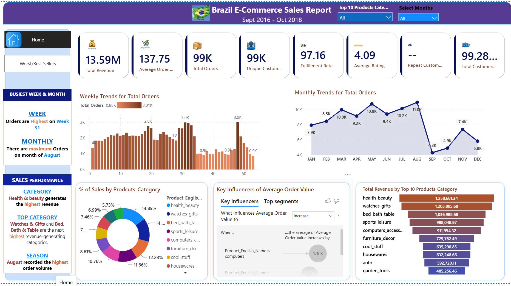
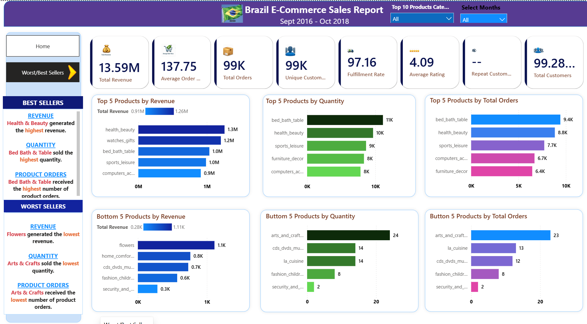
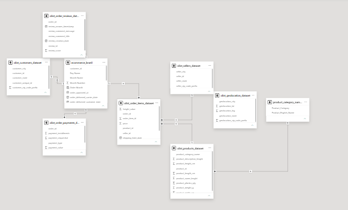

# Brazil E-Commerce Sales Dashboard

A complete **end-to-end Data Analytics** project analyzing Brazilian e-commerce sales performance using **SQL Server** and **Power BI**.

---

## 📌 Project Overview

This project analyzes the **Olist Brazilian E-Commerce Dataset** to provide actionable business insights.

---

## 🛠️ Tools & Technologies

| Tool | Purpose |
|------|---------|
| **SQL Server** | Data exploration & analysis |
| **Power BI Desktop** | Dashboard development |
| **DAX** | Measure creation |

---

## 📂 Project Structure
Brazil-Ecommerce-PowerBI-Dashboard/

├── Dashboard/

│   └── Brazil_Ecommerce_Dashboard.pbix

├── Dataset/

├── SQL/

│   └── ecommerce_analysis.sql

├── Images/

│   ├── Home_Dashboard.png

│   ├── Dashboard.png

│   └── Model.png

└── README.md
---

## 📊 Dashboard Features

### Page 1: Executive Dashboard
- Total Revenue: 13.59M
- Average Order Value: 137.75
- Total Orders: 99,281
- Weekly & Monthly Trends
- Revenue Distribution by Category

### Page 2: Best & Worst Sellers
- Top 5 Products by Revenue, Quantity, Orders
- Bottom 5 Products by Revenue, Quantity, Orders

---

## 🎯 Key Insights

- **Health & Beauty** generated highest revenue (13.59M)
- **Bed Bath & Table** highest quantity sold
- **August** had highest monthly orders
- **Flowers** lowest revenue
- **Arts & Crafts** lowest quantity

---

## 🗄️ SQL Analysis

Queries for:
- Revenue & KPI calculations
- Product rankings
- Customer behavior
- Trends analysis

---

## 📈 Data Model

**Star Schema:**
- Fact: olist_order_items_dataset
- Dimensions: Products, Customers, Sellers

---

## 📸 Dashboard Preview

---

## ✅ Skills Demonstrated

- SQL (queries, joins, aggregations)
- Data Modeling (star schema)
- Power BI (dashboards, slicers)
- DAX (measures, calculations)
- Data Visualization
- Business Analysis

---

## 👩‍💻 Author

**Aarti Chopra**
- GitHub: https://github.com/97chopra
- LinkedIn: https://linkedin.com/in/aarti-chopra

---

**Last Updated:** June 2026
